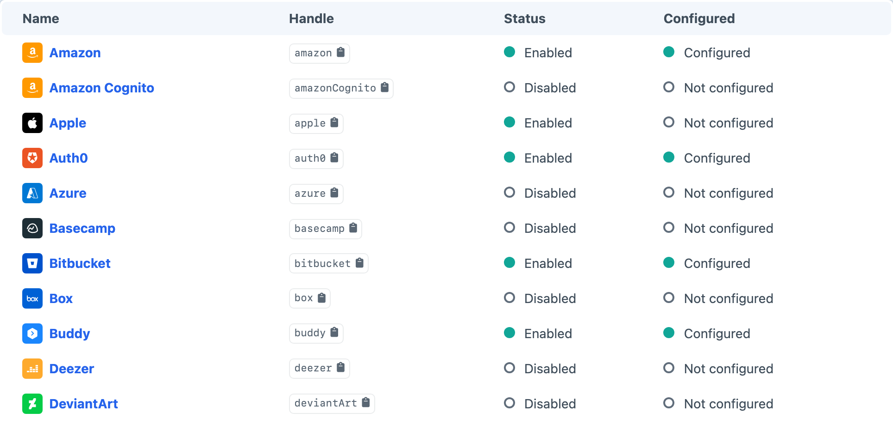
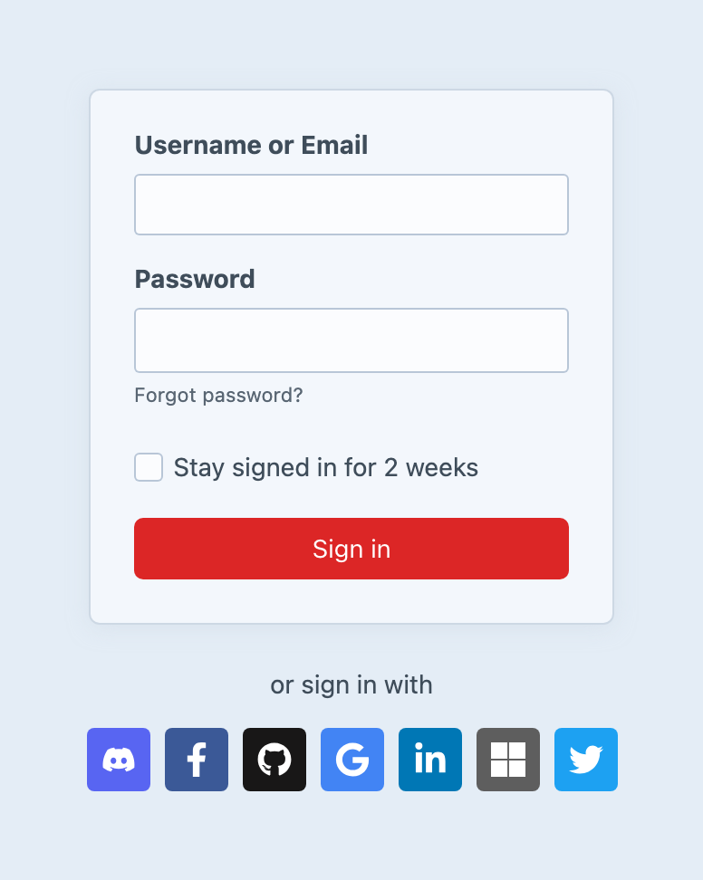
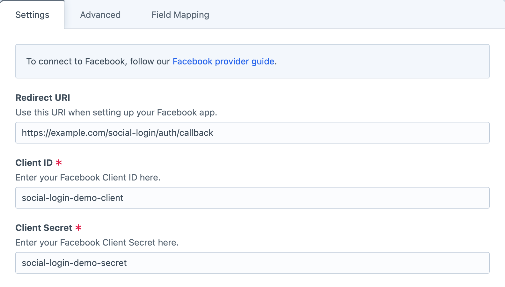
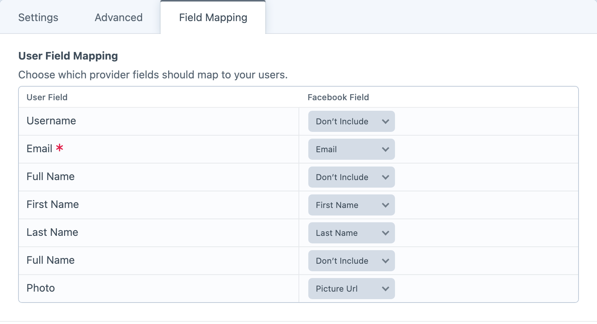

<!-- feature-intro -->
Add single sign-on to let people log in, register or connect a Craft user through an existing account with a supported social or identity provider.
<!-- feature-intro-end -->

<!-- feature-section media-size="large" -->
## Identity providers built in

Choose from more than 60 social networks and identity services, then enable only the ones that belong on your site. The provider index keeps handles, availability and configuration status together, whether you need one familiar sign-in option or a mix for different audiences.

<!-- feature-section-end -->

<!-- feature-section media-size="small" -->
## Front-end and control panel login

Give people the option to use a supported provider on the front end or when logging in to Craft itself. A provider can be used for login only, create a new Craft account when needed, or connect to an account the person already uses.

<!-- feature-section-end -->

<!-- feature-section media-size="large" -->
## Configure each provider

Keep the callback URI and application credentials for each identity service in its own provider settings. Login availability can be controlled separately for the front end and Craft control panel, without making every configured provider appear everywhere.

<!-- feature-section-end -->

<!-- feature-section media-size="large" -->
## Registration on your terms

When a provider identity does not match an existing Craft user, Social Login can create the account, populate supported attributes and custom fields, and place the new user into nominated groups. Matching does not have to rely on email: use another mapped attribute when the provider ID or a project-specific field is the safer identity key.

Craft’s activation and verification behaviour remains available, which is particularly important before allowing provider-based registration into the control panel.

<!-- feature-section-end -->

<!-- feature-section -->
## Easy API usage

Use the authorised provider client from project code when a feature needs additional API data. Templates remain in control of how each login option is presented, and extension points allow another identity service to join the same workflow.
<!-- feature-section-end -->
